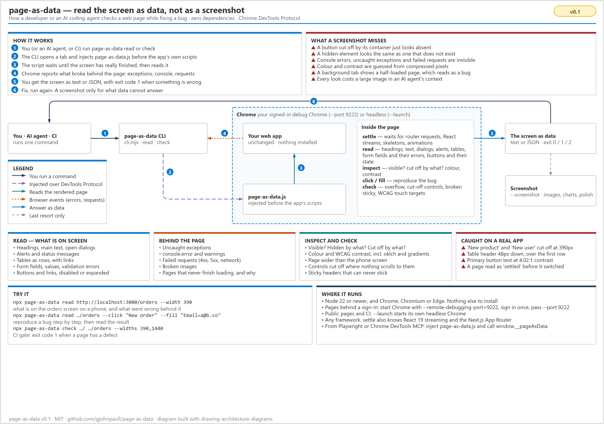

# page-as-data

**Read a web page as data instead of a screenshot.**

When you, or an AI coding agent, fix a bug in a web app, you usually take a
screenshot and look at it. A screenshot shows pixels. It cannot tell you that a
button is cut off by its container, that a request failed with a 404, or that
the page threw an error while loading. `page-as-data` tells you all of that as
plain text or JSON, in one command.

Take a screenshot only for what data cannot answer: images, charts, and
"does it look right overall".



## What it gives you

| You want to know… | A screenshot | page-as-data |
| --- | --- | --- |
| What is on the screen? | You read it off the picture | Headings, text, open dialogs, alerts, tables as rows, form fields with values and errors, buttons and whether they are disabled |
| Did something break? | Invisible | Uncaught exceptions, `console.error`, failed requests (4xx, 5xx), broken images |
| Where did my button go? | "It is not there" | `button "New product" is cut off (0% visible) by div.app-plate, and nothing scrolls to it` |
| Is this element visible? | Guess | Visible or not, and why: `display: none on div.panel`, cut off, zero size |
| Is the text readable? | Guess from compressed pixels | Exact colours and the WCAG contrast ratio, including `oklch()` colours and gradients |
| Does it work on a phone? | One picture per width | Page wider than the screen, cut-off controls, sticky headers that cannot stick, touch targets under 24×24px |
| Has the page finished loading? | A half-loaded picture looks like a bug | Waits for router requests, React streaming, skeletons and animations, and says why when it gives up |

## Requirements

- Node.js 22 or newer
- Chrome, Chromium or Microsoft Edge

Nothing else. It has no dependencies.

## Install

```sh
npm install --save-dev page-as-data   # or run it once with npx
```

Until the package is on npm, clone this repository and run `node cli.mjs` in
place of `npx page-as-data`.

## Use it

### 1. Pick a Chrome

**Pages anyone can open** (a public site, or your app in CI): add `--launch`,
and `page-as-data` starts its own headless Chrome.

**Pages behind a sign-in** (most admin screens): start Chrome with a debugging
port and its own profile, sign in once, and leave it open.

```sh
# Windows
"C:\Program Files\Google\Chrome\Application\chrome.exe" --remote-debugging-port=9222 --user-data-dir=%TEMP%\chrome-debug
# macOS
"/Applications/Google Chrome.app/Contents/MacOS/Google Chrome" --remote-debugging-port=9222 --user-data-dir=/tmp/chrome-debug
# Linux
google-chrome --remote-debugging-port=9222 --user-data-dir=/tmp/chrome-debug
```

`page-as-data` connects to port 9222 by default. It opens its own tab, and
closes it when it is done. Your other tabs are not touched.

### 2. Read a screen

```sh
npx page-as-data read http://localhost:3000/orders --width 390
```

You get the screen as text: problems first, then dialogs, alerts, headings,
form fields, tables, buttons and the visible text.

### 3. Reproduce a bug

Steps run in the order you give them. `--click` finds a button or link by its
name. `--fill` finds a field by its label. `--press` sends a real key press
(`F9`, `Enter`, `Escape`, a character…), which keyboard-shortcut handlers that
check `event.isTrusted` accept. `--wait-for "text"` waits (up to `--timeout`)
until that text is on screen, for long work whose progress never goes quiet —
a render, an upload. The page settles after each step, including screen
changes an app schedules on a short timer (a fade, then the next route).

```sh
npx page-as-data read http://localhost:3000/orders \
  --click "New order" --fill "Email=a@b.co" --click "Save" \
  --inspect "Save"
```

`--inspect` answers the questions you would take a screenshot for: where the
element is, whether it is visible (and if not, why), its colours, and whether
its text is readable. It takes visible text or a CSS selector.

Real output from this repository's test page (the button list and the page text are trimmed here):

```text
Fixture: planted bugs — / @ 390px, settled in 291ms
  ✔ fill "Name" = "Ada" → input "Name"
  ✔ click "Add row" → button "Add row"

PROBLEMS
  • uncaught exception: Error: Fixture uncaught error |     at http://localhost:3000/:101:15
  • failed request: GET http://localhost:3000/missing-image.png → 404
  • failed request: GET http://localhost:3000/hero.jpg → 404
  • failed request: GET http://localhost:3000/api/missing → 404
  • console.error: Fixture console error
  • broken image: http://localhost:3000/missing-image.png
  • invalid field "Email": Enter a valid email address
  • layout: Page is 616px wide in a 390px viewport, so it scrolls sideways
  • layout: button "Hidden action" is cut off (15% visible) by div.clipping-bar, and nothing scrolls to it
  • layout: th "Name" is sticky (top: 48px) inside div.table-box (overflow auto/auto), which never scrolls vertically, so it never sticks, and its offset pushes it 48px down over the content below
  • layout (warning): button "Crowded A" is 16×16px, under WCAG 2.2's 24×24px, and too close to button "Crowded B"
  • layout (warning): button "Crowded B" is 16×16px, under WCAG 2.2's 24×24px, and too close to button "Crowded A"

OPEN DIALOGS
  [Confirm delete] This removes the venue.

ALERTS / STATUS MESSAGES
  (alert) Saving failed: the server did not answer

HEADINGS
  h1 Planted bugs
    h2 Confirm delete

FORM FIELDS
  Name [text] = "Ada"
  Email [text] = "not-an-email" INVALID: Enter a valid email address

TABLE 0 — 2 rows
  Name | Role
  Grace | Admin
  Ada | User

INSPECT "Faint note" — 1 found
  p "Faint note" at x16 y402 358×22: visible
    colour rgb(204, 204, 204) on rgb(255, 255, 255), contrast 1.61:1 (TOO LOW); font 16px 400; block, static

INSPECT "Hidden action" — 1 found
  button "Hidden action" at x297 y125 140×32: NOT visible (cut off by div.clipping-bar, 15% shown)
    colour rgb(0, 0, 0) on rgb(240, 240, 240), contrast 18.43:1 (readable); font 16px 400; inline-block, static
```

Add `--json` for the full result, including every table row and link.

### 4. Check many pages, for CI

```sh
npx page-as-data check http://localhost:3000/ http://localhost:3000/orders --widths 390,1440 --launch
```

Each page is checked at each width. The exit code is `1` when an error is
found, so a CI job fails on a real defect. Warnings (small touch targets,
`console.error`) do not fail the job unless you add `--strict`.

```yaml
# GitHub Actions: after your app is running on port 3000
- run: npx page-as-data check http://localhost:3000/ http://localhost:3000/orders --launch
```

### 5. Take a screenshot, only when needed

```sh
npx page-as-data read http://localhost:3000/dashboard --screenshot dashboard.png
```

Use it for images, charts and overall visual polish. Everything else is
already in the data.

## Options

| Option | Command | What it does |
| --- | --- | --- |
| `--width 390` | read | Viewport width. Default 1440. Below 768 it emulates a phone with touch. |
| `--widths 390,1440` | check | Widths to check. Default `390,1440`. |
| `--click "Name"` | read | Click a control by its name. Repeatable. |
| `--fill "Label=value"` | read | Fill a field by its label. Repeatable. Works with React-controlled inputs. |
| `--inspect "text or selector"` | read | Box, visibility, colours and contrast of an element. Repeatable. |
| `--screenshot file.png` | read | Also save a screenshot. |
| `--strict` | check | Exit 1 on warnings too. |
| `--port 9222` | both | Attach to a Chrome started with `--remote-debugging-port`. |
| `--launch` | both | Start a headless Chrome instead. |
| `--json` | both | Machine-readable output. |
| `--timeout 15000` | both | How long to wait for a page to settle, in ms. |

Exit codes: `0` nothing found, `1` problems found, `2` could not run (no
Chrome, bad URL, a step could not find its control).

## For AI coding agents

An agent that looks at screenshots spends a large image on every look, and
still guesses. Put this in your `CLAUDE.md`, `AGENTS.md` or similar:

```markdown
## Checking a screen
Read it with `npx page-as-data read <url>` (add `--width 390` for phone,
`--click` / `--fill` to reproduce, `--inspect` for "is it visible / readable").
Take a screenshot only for images, charts or overall visual polish.
Before calling UI work done, run `npx page-as-data check <urls>`; it must exit 0.
```

## Use it inside your own browser tooling

The part that runs in the page is one file, `page-as-data.js`. Inject it
**before** the page's own scripts, so it can see router requests from the
start, and call `window.__pageAsData`.

```js
// Playwright
import { readFileSync } from 'node:fs'
import { createRequire } from 'node:module'
const inPage = readFileSync(createRequire(import.meta.url).resolve('page-as-data/in-page'), 'utf8')
await page.addInitScript(inPage)
await page.goto('http://localhost:3000/orders')
await page.evaluate(() => window.__pageAsData.settle())
const screen = await page.evaluate(() => window.__pageAsData.read())
const issues = await page.evaluate(() => window.__pageAsData.layoutIssues())
```

With Chrome DevTools MCP, pass the file's contents as `initScript` to
`navigate_page`, then call the same functions with `evaluate_script`. You can
also paste the file into the DevTools console.

| Function | Returns |
| --- | --- |
| `await settle({ timeoutMs })` | `{ settled, ms }`, or `why` it did not settle |
| `read({ maxText, maxRows })` | url, title, headings, dialogs, alerts, text, tables, form, controls, images |
| `inspect(query)` | For each match: box, visible, why hidden or cut off, colours, contrast, readable |
| `layoutIssues()` | page overflow, clipped controls, sticky that cannot stick, small targets |
| `await click(name)` / `await fill(label, value)` | What it acted on, then settles |

It reads the page and nothing else. It makes no network calls of its own, and
it only wraps `window.fetch` to count React Server Component requests. It never
changes them. Password fields are reported as `••••`, never their value.

From Node, `import { readPage, checkPages } from 'page-as-data'` returns the
same results as the CLI's `--json`.

## What the checks mean

| Check | Error when | Reference |
| --- | --- | --- |
| Page overflow | The page is wider than the viewport, so it scrolls sideways. Names the elements that make it wide. | — |
| Cut-off control | A button, link or field is cut off by a container that clips and does not scroll. A control inside a scrollable box is fine. | — |
| Sticky that cannot stick | `position: sticky` inside a box that never scrolls on that axis. An error when its offset also pushes it over the content; a warning otherwise. | CSS Positioned Layout |
| Small touch target (warning) | Smaller than 24×24px **and** too close to another target. A small target with enough space around it passes, as the rule allows. | WCAG 2.2 SC 2.5.8 |
| Contrast (`--inspect`) | Under 4.5:1, or 3:1 for large text. Measured against a gradient's worst stop. | WCAG 2.2 SC 1.4.3 |

## Limits

- **Chrome-family browsers only.** It uses the Chrome DevTools Protocol.
- **"Settled" is a good guess, not a promise.** It waits for router requests,
  React streams, skeletons (`aria-busy`, `[data-skeleton]`, `.animate-pulse`,
  `.skeleton`) and animations. A page that polls forever, or shows a
  permanently pulsing indicator, times out and says why.
- **Text on a background image** gets no contrast number; it says it needs a
  screenshot instead of guessing.
- **Shadow DOM and cross-origin iframes are not read yet.**
- **A background tab never finishes React 19 streaming**, because Chrome does
  not run animation frames there. The CLI brings its tab to the front; if you
  inject the script yourself, keep the tab in front.

## Develop

```sh
npm test    # runs the CLI against test/fixture.html in a headless Chrome
```

The fixture plants one of each bug, next to a look-alike that is **not** a bug,
and the tests check both: every bug found, no look-alike reported.

The diagram is built from `docs/diagram/how-it-helps.py` with
[drawing-architecture-diagrams](https://github.com/gjohnpaull/drawing-architecture-diagrams).

## License

MIT
